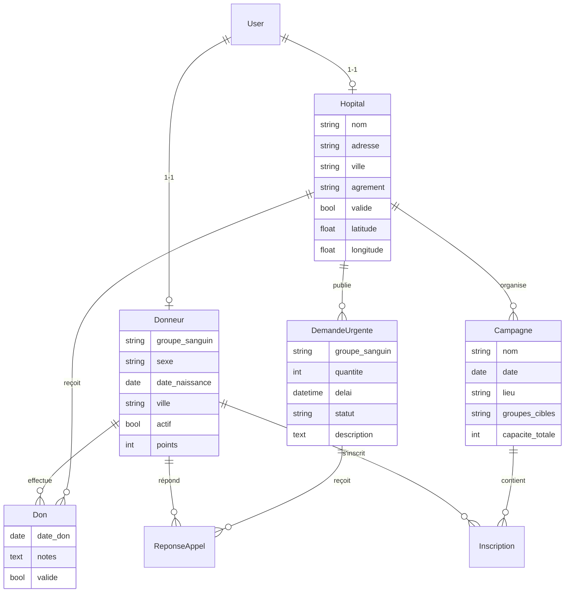

<p align="center">
  
  
  
  
  
</p>

<h1 align="center">🩸 BloodConnect</h1>

<p align="center">
  <strong>Plateforme de gestion du don de sang — Django</strong><br>
  Mise en relation de donneurs volontaires avec des établissements hospitaliers
</p>

<p align="center">
  <em>Projet d'évaluation — Développement Web avec Django — 2ème ISET — 2025-2026</em>
</p>

---

## 📋 Présentation

**BloodConnect** est une plateforme web de gestion du don de sang développée avec Django. Elle met en relation des **donneurs volontaires** avec des **établissements hospitaliers** ayant des besoins urgents en sang.

La plateforme permet la gestion complète des donneurs, des demandes hospitalières, des campagnes de collecte et de l'historique des dons, tout en intégrant un système de gamification pour encourager les dons.

---

## ✨ Fonctionnalités

### 👤 Gestion des comptes
- Inscription **Donneur** (informations personnelles, groupe sanguin, localisation)
- Inscription **Hôpital** (nom, adresse, numéro d'agrément — validé par l'admin)
- Connexion / Déconnexion avec **gestion des rôles** (Admin, Donneur, Hôpital)
- Modification du profil et des informations médicales
- Désactivation temporaire du compte donneur (indisponibilité)

### 🏥 Gestion des demandes urgentes (Hôpital)
- Publier une demande urgente : groupe sanguin, quantité, délai, description
- Modifier ou clôturer une demande
- Voir les donneurs ayant répondu (via **modal Bootstrap**)
- Historique des demandes publiées

### 🩸 Espace Donneur
- Tableau de bord : prochaine date d'éligibilité, historique des dons, urgences compatibles
- Répondre à un appel urgent (exprimer son intention de donner)
- Enregistrer un don effectué avec date et établissement
- Calcul automatique de la prochaine date de don (56 jours H / 84 jours F)
- Rappel des campagnes inscrites

### 📅 Gestion des campagnes de collecte
- L'hôpital crée une campagne : nom, date, lieu, groupes ciblés, nombre de créneaux
- Les donneurs s'inscrivent avec **choix du créneau horaire**
- Gestion de la **capacité maximale** par campagne

### 📊 Statistiques & Administration
- Tableau de bord admin : total donneurs, total dons, demandes actives par groupe sanguin
- Validation des comptes hospitaliers
- Carte interactive des demandes urgentes par ville
- **Export CSV** de la liste des donneurs (admin uniquement)

---

## 🎨 Design & Technologies

| Catégorie | Technologie |
|---|---|
| **Backend** | Django 6.0 · Python 3.13 |
| **Base de données** | SQLite3 |
| **Frontend** | Bootstrap 5.3 · CSS Glassmorphism |
| **Graphiques** | Chart.js (Doughnut, Line) |
| **Cartographie** | Leaflet.js (dark tiles CARTO) |
| **Notifications** | Toastify.js |
| **Icônes** | Bootstrap Icons |
| **Typographie** | Google Fonts — Inter |

### 🌟 Points forts du design
- **Glassmorphism** : interface sombre avec panneaux transparents et effets de flou
- **Gamification** : 🥉 Goutte de Bronze → 🥈 Héros d'Argent → 🥇 Sauveur d'Or
- **Carte interactive** : visualisation géographique des urgences en Tunisie
- **Notifications Toast** : alertes fluides liées au système de messages Django
- **Design responsive** : adapté à tous les écrans

---

## 🏗️ Architecture du projet

```
BloodConnect/
├── bloodconnect/          # Configuration principale Django
│   ├── settings.py
│   ├── urls.py
│   └── wsgi.py
├── accounts/              # Authentification & inscription
│   ├── forms.py           # DonneurRegisterForm, HopitalRegisterForm
│   ├── views.py           # login, logout, register
│   └── urls.py
├── index/                 # Application principale
│   ├── models.py          # Donneur, Hopital, DemandeUrgente, Don, Campagne...
│   ├── views.py           # 15 vues (admin, donneur, hopital, campagnes)
│   ├── forms.py           # DemandeUrgenteForm, CampagneForm, DonneurProfileForm
│   ├── urls.py            # 21 routes
│   └── templates/
│       ├── base.html                   # Template de base (navbar, footer, toasts)
│       ├── accounts/
│       │   ├── login.html
│       │   ├── register_donneur.html
│       │   └── register_hopital.html
│       └── index/
│           ├── index.html              # Page d'accueil
│           ├── dashboard_admin.html    # Dashboard administrateur
│           ├── dashboard_donneur.html  # Dashboard donneur
│           ├── dashboard_hopital.html  # Dashboard hôpital
│           ├── profil_donneur.html     # Modification du profil
│           ├── enregistrer_don.html    # Formulaire d'enregistrement de don
│           ├── create_demande.html     # Création de demande urgente
│           ├── edit_demande.html       # Modification de demande
│           ├── create_campagne.html    # Création de campagne
│           └── list_campagnes.html     # Liste des campagnes
├── static/
│   └── css/
│       └── style.css      # Glassmorphism, boutons, formulaires
├── db.sqlite3
└── manage.py
```

---

## 🗃️ Modèle de données



---

## 🚀 Installation & Lancement

### Prérequis
- Python 3.10+
- pip

### Étapes

```bash
# 1. Cloner le dépôt
git clone https://github.com/votre-username/BloodConnect.git
cd BloodConnect

# 2. Créer un environnement virtuel
python -m venv env

# 3. Activer l'environnement virtuel
# Windows :
env\Scripts\activate
# macOS/Linux :
source env/bin/activate

# 4. Installer les dépendances
pip install django

# 5. Appliquer les migrations
python manage.py makemigrations index
python manage.py migrate

# 6. Créer un superutilisateur (admin)
python manage.py createsuperuser

# 7. Lancer le serveur
python manage.py runserver
```

Accéder à l'application : **http://127.0.0.1:8000/**

---

## 👥 Acteurs du système

| Acteur | Description | Accès |
|---|---|---|
| **Administrateur** | Supervise la plateforme, valide les comptes hôpitaux, accède aux statistiques | `/dashboard/admin/` |
| **Donneur** | S'inscrit, consulte les urgences, répond aux appels, s'inscrit aux campagnes | `/dashboard/donneur/` |
| **Hôpital** | Publie des demandes urgentes, crée des campagnes, gère les réponses | `/dashboard/hopital/` |

---

## 🎮 Système de Gamification

Les donneurs accumulent des points à chaque action et progressent à travers 4 niveaux :

| Niveau | Seuil | Badge |
|---|---|---|
| Nouveau Donneur | 0 pts | 🩸 |
| Goutte de Bronze | 100 pts | 🥉 |
| Héros d'Argent | 500 pts | 🥈 |
| Sauveur d'Or | 1000 pts | 🥇 |

**Points attribués :**
- Répondre à un appel urgent : **+25 pts**
- S'inscrire à une campagne : **+50 pts**
- Enregistrer un don effectué : **+100 pts**

---

## 📸 Captures d'écran

> Les captures d'écran des différents dashboards seront ajoutées ici.

<!-- 


-->

---

## 📄 Licence

Ce projet est développé dans le cadre d'un projet universitaire à l'**ISET** (Institut Supérieur des Études Technologiques).

---

<p align="center">
  Fait avec ❤️ et Django
</p>
